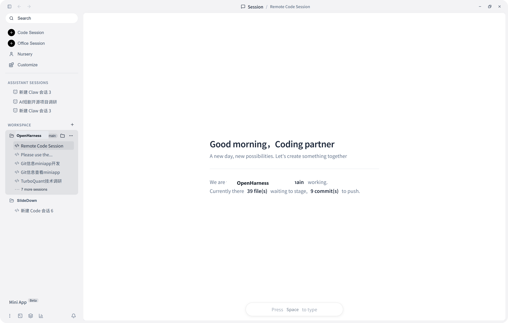

[中文](./README.zh-CN.md) | **English**

<div align="center">


[](https://github.com/GCWing/OpenHarness/releases)
[](https://openopenharness.com/)
[](./LICENSE)
[](https://github.com/GCWing/OpenHarness)

</div>

## OpenHarness

OpenHarness is a desktop home for AI agents.

It is designed for people who want more than a chat box: a workspace where agents can think, act, run tools, edit code, work through files, stay in context, and keep going across sessions.

It aims to feel less like "asking an assistant for one answer" and more like living beside an evolving system that can help with real work every day.



## Why It Exists

Most AI products are still shaped like short conversations.

OpenHarness takes a different path. It treats the agent as something that belongs inside your working environment: close to your files, your terminal, your editor, your long-running tasks, and even your phone when you are away from the desk.

The result is a more persistent, more operational, and more personal AI workspace.

## What It Feels Like

- A companion when you want continuity, memory, and style
- An execution-first agent when you want something done
- A desktop control center for code, documents, terminals, and tools
- A remotely reachable system you can wake up from your phone

## Core Experience

### Agentic Desktop

OpenHarness centers the experience around a desktop app, not a browser tab you forget to come back to. The desktop becomes the place where agents can actually work with context, files, tools, and runtime state.

### Dual Working Modes

- **Assistant Mode**: warmer, longer-memory, preference-aware, better for ongoing collaboration
- **Professional Mode**: cleaner, leaner, more execution-focused, better for immediate tasks

### Remote Control

Pair a phone by scanning a QR code and use it as a command center for the desktop agent. OpenHarness also supports remote command flows through channels such as Telegram, Feishu, and WeChat bots.

### Real Tools, Not Just Text

OpenHarness is built around the idea that useful agents need more than words. It brings together terminals, editors, Git workflows, files, structured tools, and an agent runtime that can coordinate them.

## Agent Lineup

| Agent | Role | What It Is Good At |
| --- | --- | --- |
| Personal Assistant | Your long-term companion | Memory, personal preferences, ongoing collaboration, orchestration |
| Code Agent | Engineering work | Planning, editing, debugging, reviewing, running tools and verification |
| Cowork Agent | Knowledge work | Documents, office files, structured workflows, expandable capabilities |
| Custom Agent | Specialist roles | Domain-specific behavior defined around your own needs |

## Ecosystem

OpenHarness is meant to grow.

It supports:

- Skills
- MCP and MCP-based app integrations
- Custom agents
- Mini apps generated from requirements into runnable interfaces

The goal is not only to ship one agent, but to support an environment where many kinds of agents and capabilities can live together.

## Platform Support

OpenHarness is built for:

- Windows
- macOS
- Linux

The main experience is desktop-first, with mobile web used for pairing and remote control.

## For Builders

If you want to run or build the project locally, here are the fastest entry points.

### Prerequisites

- Node.js 18+
- `pnpm`
- Rust stable
- Tauri prerequisites for your platform

### Run In Development

```bash
pnpm install
pnpm run desktop:dev
```

### Build The Desktop App

```bash
pnpm run desktop:build
```

### Build A Windows Release Executable

```bash
pnpm run desktop:build:exe
```

Output:

- `target/release/openharness-desktop.exe`

## A Note On Delivery Builds

Release builds are intentionally optimized for shipping, so the first full build can take a while. Repeated builds get much faster when existing artifacts are preserved.

The current Windows delivery pipeline also auto-detects `sccache` when available, which helps repeated release builds.

## Repository At A Glance

```text
src/apps/desktop   Tauri desktop app
src/web-ui         Main React interface
src/mobile-web     Mobile pairing and remote control UI
src/crates/*       Rust core, runtime, transport, events, services
tests/e2e          End-to-end tests
scripts            Build and packaging scripts
```

## Contributing

If you want to contribute, start here:

- [CONTRIBUTING.md](./CONTRIBUTING.md)
- [CONTRIBUTING_CN.md](./CONTRIBUTING_CN.md)

Good contributions are not limited to code. Product ideas, interaction design, workflow improvements, agent capabilities, and ecosystem extensions all matter here.

## License

OpenHarness is released under the [MIT License](./LICENSE).
