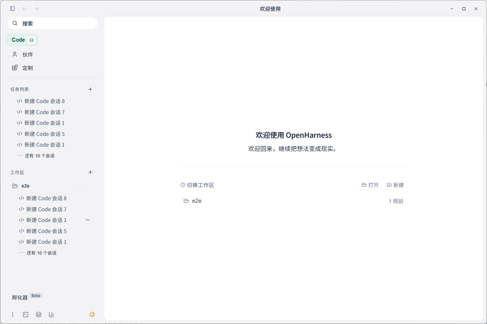
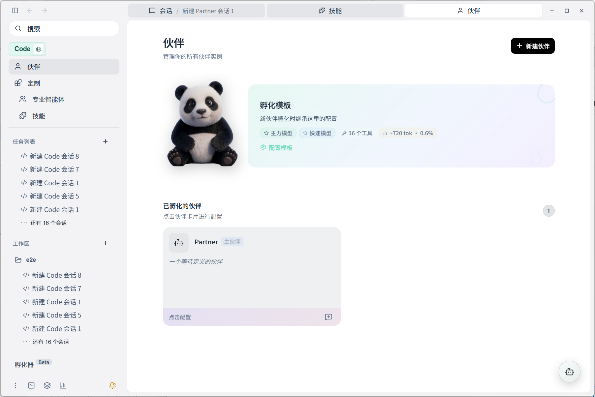
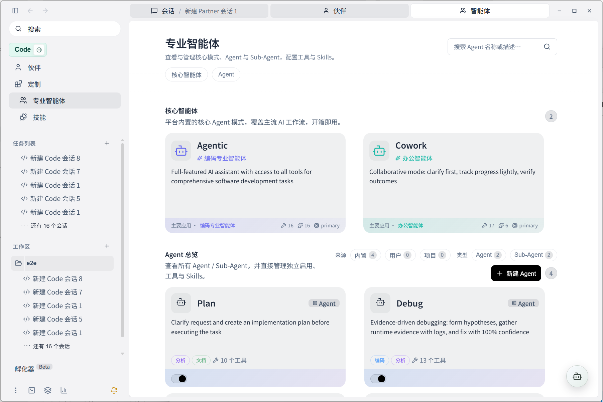
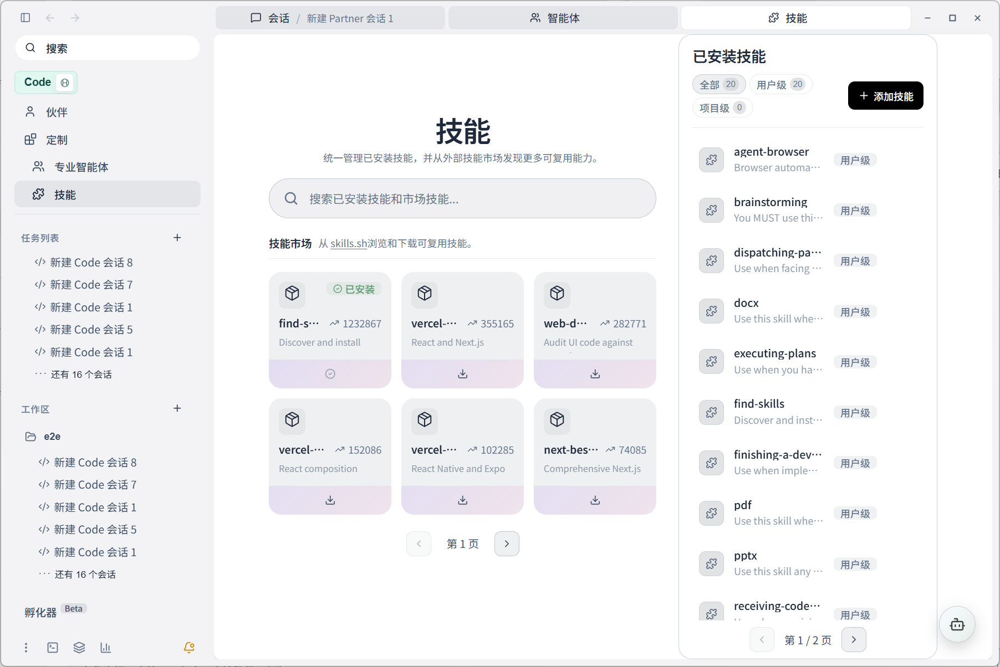

<div align="center">


# OpenHarness

**把 AI Agent 放进真正的开发工作台里。**

一个桌面优先的 Agent 工作空间：能聊天，能读项目，能改文件，能开终端，能看 Git，能运行工具，也能通过移动端远程唤起。



</div>

## OpenHarness 是什么

OpenHarness 不是一个孤立的聊天窗口，而是一个为 AI Agent 准备的本地工作台。

它把项目、会话、文件、终端、Git、技能、智能体和可扩展工具放在同一个桌面界面里。你不需要在多个工具之间反复复制上下文，也不需要让 Agent 每次从零理解你的项目。它更像一个可以长期留在桌面上的协作空间：想法、代码、文件和任务都在这里继续生长。

## 它适合做什么

- 和 Agent 一起理解项目、拆解任务、修改代码。
- 在对话、文件、终端、Git 和浏览器之间顺畅切换。
- 管理不同用途的智能体，让它们服务于编码、办公、调试、规划等场景。
- 安装和沉淀技能，把可复用能力变成稳定工作流。
- 通过移动端、远程连接或中继服务继续触达桌面 Agent。

## 一个真正的工作台

OpenHarness 的核心不是“问一句，答一句”，而是让 Agent 进入真实工作环境。它可以围绕当前工作区持续协作，也可以配合终端、文件系统、代码编辑器、Git 状态和项目上下文推进任务。

欢迎页、任务列表和工作区入口让你可以快速回到之前的上下文。每个会话都不只是聊天记录，更像一次可以继续推进的工作现场。

## 伙伴：让协作有持续性

伙伴页面用于管理可以长期陪伴工作的 Agent 实例。你可以从模板孵化新的伙伴，并为不同任务保留不同配置。



这类体验更适合长期任务、个人偏好、固定工作流和“下次继续”的场景。它让 Agent 不只是一次性助手，而是一个可以逐步调校的协作者。

## 专业智能体：把能力拆成角色

OpenHarness 内置专业智能体管理。不同智能体可以面向不同工作方式：有的负责完整编码任务，有的负责协作办公，有的负责规划、调试、审查或更细分的流程。



这种设计让复杂工作不必只依赖一个泛用助手。你可以把不同模式、工具和技能组合成适合自己的 Agent 阵列。

## 技能：把经验变成可复用能力

技能页面用于管理已安装技能，也可以从技能市场发现新的能力。技能让 Agent 拥有更明确的工作方法，例如浏览器自动化、文档处理、计划执行、代码审查、PDF/PPTX/XLSX 工作流等。



当某类任务反复出现时，它就不该永远停留在临时提示词里。OpenHarness 希望把这些方法沉淀成可以安装、管理、复用和扩展的能力。

## 能力一览

| 场景 | OpenHarness 提供什么 |
| --- | --- |
| 会话协作 | 多会话、任务列表、工作区上下文、可继续的 Agent 对话 |
| 项目工作 | 文件浏览、代码编辑、终端、Git、项目洞察 |
| 智能体管理 | 专业智能体、伙伴实例、自定义 Agent 与 Sub-Agent |
| 技能扩展 | 技能安装、技能市场、工具链能力沉淀 |
| 可视化工作 | Mermaid、MiniApp、面板视图、浏览器场景 |
| 远程入口 | 移动端 Web、SSH、局域网/中继配对、二维码连接 |
| 桌面集成 | Tauri 桌面能力、系统通知、文件权限、剪贴板、截图/OCR |

## 快速体验

准备环境：

```bash
pnpm install
```

启动桌面开发版：

```bash
pnpm run desktop:dev
```

只启动 Web UI：

```bash
pnpm run dev:web
```

运行 CLI：

```bash
pnpm run cli:dev -- chat --workspace .
```

构建桌面应用：

```bash
pnpm run desktop:build
```

## 项目入口

- 主界面：`src/web-ui`
- 桌面端：`src/apps/desktop`
- 核心能力：`src/crates/core`
- CLI：`src/apps/cli`
- 中继服务：`src/apps/relay-server`
- MiniApp：`MiniApp`

## 许可

MIT License。详见 `LICENSE`。
