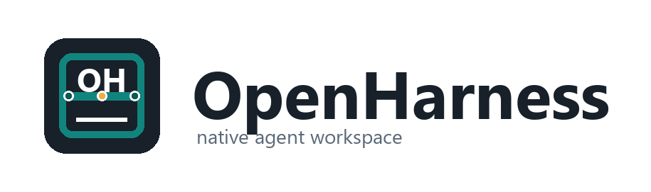
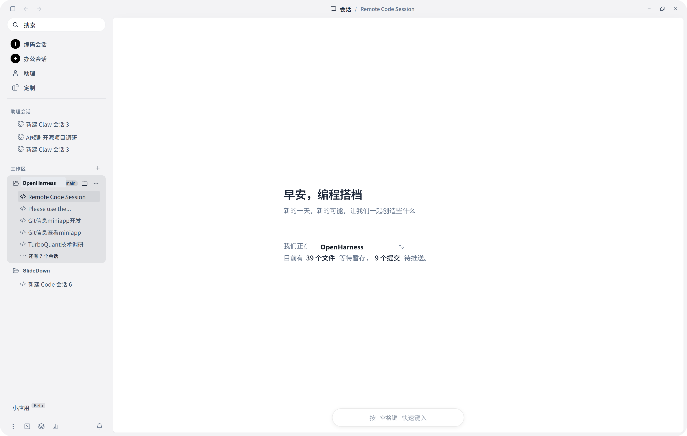

**中文** | [English](./README.md)

<div align="center">



[](https://github.com/GCWing/OpenHarness/releases)
[](https://openopenharness.com/)
[](./LICENSE)
[](https://github.com/GCWing/OpenHarness)

</div>

## OpenHarness 是什么

OpenHarness 是一个面向 AI Agent 的桌面工作台。

它不是把 Agent 塞进一个聊天框里，而是把 Agent 放进真正的工作环境里: 文件、终端、编辑器、工具调用、长期上下文、移动端遥控，这些都属于它的日常场景。

它想做的，不是“一次性回答问题的助手”，而是一个能长期陪你工作、持续执行任务、逐步长成你自己的 Agent 系统。



## 为什么做它

大多数 AI 产品，今天仍然更像一段短对话。

OpenHarness 想走另一条路。它把 Agent 当成工作环境中的常驻角色，而不是一次请求后的临时回应。它应该靠近你的桌面、项目、运行时、终端、文档，以及你离开电脑后仍然能触达它的手机。

这让它更像一个持续协作的系统，而不是一个只会回复文本的界面。

## 它想带来的体验

- 当你需要延续性时，它像一个真正熟悉你的伙伴
- 当你需要效率时，它像一个直接开始干活的执行型 Agent
- 当你在桌面工作时，它像一个统一调度代码、文件、工具和终端的控制中心
- 当你不在桌前时，它仍然可以被手机唤醒和遥控

## 核心体验

### Agentic Desktop

OpenHarness 以桌面端为中心，而不是一个随手开随手关的网页标签页。桌面应用才是 Agent 真正工作的地方: 有上下文、有文件、有工具、有状态，也有持续性。

### 双模式协作

- **Assistant Mode**：更有陪伴感，更强调记忆、偏好与长期协作
- **Professional Mode**：更克制、更直接、更偏执行，适合快速完成具体任务

### 远程控制

扫描二维码后，手机就能成为桌面 Agent 的遥控入口。除了移动端浏览器，OpenHarness 也支持通过 Telegram、飞书、微信等通道发起远程指令。

### 不只是聊天

OpenHarness 的出发点很明确: 有用的 Agent 不能只会说话。它需要真的接入终端、编辑器、Git、文件系统、结构化工具和执行链路，能够把事情推进下去。

## Agent 阵列

| Agent | 定位 | 擅长的事情 |
| --- | --- | --- |
| Personal Assistant | 你的长期伙伴 | 记忆、偏好、持续协作、调度能力 |
| Code Agent | 工程执行者 | 规划、改代码、调试、审查、跑工具和验证 |
| Cowork Agent | 知识工作助手 | 文档、办公文件、结构化处理、能力扩展 |
| Custom Agent | 定制专家 | 为特定场景定义专属能力和行为 |

## 生态方向

OpenHarness 不想只停在一个内置 Agent 上。

它支持：

- Skills
- MCP 与基于 MCP 的应用集成
- 自定义 Agent
- 从需求生成可运行界面的 Mini App

目标不是只做一个“会聊天的产品”，而是做一个能持续长出新能力的 Agent 环境。

## 平台支持

OpenHarness 面向：

- Windows
- macOS
- Linux

主体验以桌面端为核心，移动端主要负责配对和遥控。

## 如果你想运行它

如果你想本地体验或参与构建，最短路径如下。

### 环境要求

- Node.js 18+
- `pnpm`
- Rust stable
- 当前平台对应的 Tauri 依赖

### 开发模式启动

```bash
pnpm install
pnpm run desktop:dev
```

### 构建桌面端

```bash
pnpm run desktop:build
```

### 构建 Windows 发布版 `exe`

```bash
pnpm run desktop:build:exe
```

产物：

- `target/release/openharness-desktop.exe`

## 关于交付构建

Release 构建本来就偏重交付质量，所以第一次完整构建会比较慢。只要保留已有构建产物，后续重复构建会快很多。

当前 Windows 交付构建链路也会在本机存在 `sccache` 时自动启用它，用来加速重复 release 构建。

## 仓库结构一览

```text
src/apps/desktop   Tauri 桌面应用
src/web-ui         React 主界面
src/mobile-web     移动端配对与遥控界面
src/crates/*       Rust 核心、runtime、transport、events、services
tests/e2e          端到端测试
scripts            构建与打包脚本
```

## 参与贡献

如果你想参与，先看：

- [CONTRIBUTING.md](./CONTRIBUTING.md)
- [CONTRIBUTING_CN.md](./CONTRIBUTING_CN.md)

这里欢迎的不只是代码。产品想法、交互体验、工作流设计、Agent 能力、生态扩展，都是很重要的贡献方向。

## 许可证

OpenHarness 使用 [MIT License](./LICENSE)。
