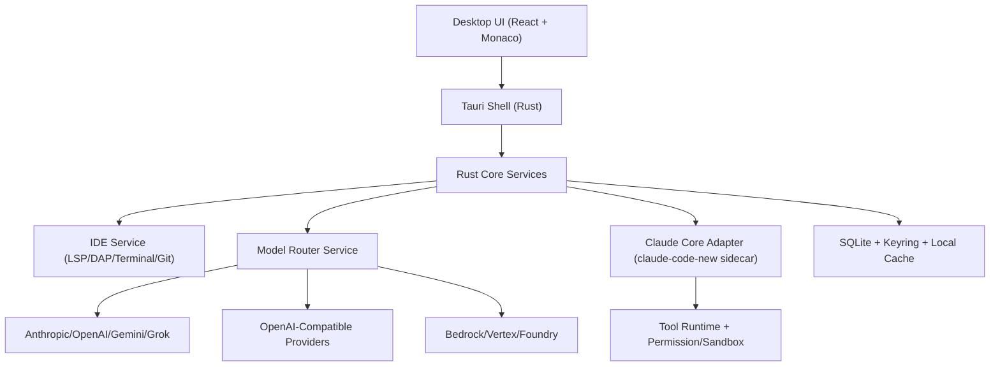

# OpenHarness 消费级桌面 AI Coding 工具项目设计与提示词

## 0. 参考输入与前提

本设计基于以下资料抽取：

- `F:\G\demo\OpenHarness\ClaudeCode技术分析文档.md`
- `F:\G\demo\OpenHarness\桌面端应用实现文档.md`
- `F:\G\demo\OpenHarness\模型提供商实现文档.md`
- 本地代码库 `F:\G\demo\claude-code-new`（`QueryEngine`、`Tool`、`BashTool`、`AgentTool`、`services/api/*`、`bridge/*`）

说明：

- `F:\G\demo\claude-code` 目录为空，实际可集成代码位于 `claude-code-new`。
- 目标是“消费级”产品：开箱可用、尽量少配置、默认安全、UI 友好，同时保留专业 IDE 能力。

---

## 1. 产品目标（面向消费级用户）

### 1.1 核心价值

1. 一体化：聊天 + 代码编辑 + 终端 + 调试 + Git 全在一个桌面应用里。
2. 多模型：兼容主流模型提供商，用户可 BYOK，也可用平台托管路由。
3. 可控安全：默认只读/受限执行，所有高风险操作有清晰确认。
4. 强能力：复用 Claude Code 核心 Agent 能力（工具调用、权限系统、多 Agent、MCP/LSP）。

### 1.2 典型用户

- 非专业工程师（产品、运营、独立开发者）想“用自然语言改代码”
- 前端/全栈开发者需要“边聊天边改项目”
- 小团队需要“可控的 AI 编程助手”

---

## 2. 技术架构（Rust + Tauri + Sidecar）



### 2.1 分层职责

- UI 层（WebView）：
  - 会话、编辑器、Diff、终端、模型配置、权限弹窗
- Rust Core：
  - 会话编排、任务队列、事件总线、状态持久化、插件生命周期
- Claude Core Adapter（关键）：
  - 以 sidecar 方式接入 `claude-code-new` 的 Agent 循环和工具系统
- Model Router：
  - 提供商管理、模型路由、故障转移、计费统计
- IDE Service：
  - LSP、DAP、终端、Git、索引/检索

---

## 3. 关键模块设计

## 3.1 桌面端壳（参考 OpenCode 桌面架构）

- 技术：Tauri v2 + Rust（`tokio`、`serde`、`sqlx`、`tracing`）
- 能力：
  - 多平台（Win/macOS/Linux）
  - 自动更新
  - 原生菜单与全局快捷键
  - Sidecar 生命周期管理（启动、健康检查、崩溃恢复）

## 3.2 IDE 能力（新增重点）

- 编辑器：Monaco（多 Tab、语法高亮、内联补全、代码透镜）
- 工程视图：文件树 + 全局搜索（rg/tantivy）
- 语言智能：LSP 聚合（TypeScript、Rust、Python、Go 等）
- 调试：DAP 适配层（MVP 先支持 Node/Python）
- 终端：PTY 多实例 + 会话保存
- Git：状态、Diff、Stage/Commit、冲突引导

## 3.3 Agent 编排层

- 一个工作区一个主会话，支持子 Agent 并行
- 统一事件流：`token`、`tool_request`、`permission_required`、`tool_result`、`diff_ready`、`task_done`
- 任务模型：
  - 前台任务（实时交互）
  - 后台任务（长任务、批量改造、测试回归）

## 3.4 多模型提供商层（参考 OpenCode Provider）

- Provider Registry（持久化配置 + 可用性状态）
- Model Catalog（模型能力描述：上下文、工具调用、价格、速率）
- 路由策略：
  - Sticky Provider（会话粘性）
  - Weighted RR（权重）
  - Fallback（故障转移）
  - 429 指数退避重试
- 格式适配：
  - Anthropic
  - OpenAI / OpenAI-Compatible
  - Gemini
  - Grok
  - Bedrock / Vertex / Foundry

## 3.5 安全与权限（参考 Claude Code 权限链）

- 默认模式：`read-only`（消费级默认）
- 权限等级：
  1. 读取文件
  2. 编辑文件
  3. 执行命令（受沙箱和路径约束）
  4. 网络访问
- 保护机制：
  - 路径白名单 + 工作区边界校验
  - 危险命令识别（`rm -rf`、系统路径删除等）
  - 沙箱执行 + 超时/资源限制
  - 审计日志（谁、何时、改了什么）

---

## 4. Claude Code 核心能力集成方案

## 4.1 集成原则

不要一开始重写全部 Agent 逻辑到 Rust。先“复用 + 适配”，后续再逐步 Rust 化。

## 4.2 推荐方案（分阶段）

### Phase A：Sidecar 直连（最快落地）

- Rust 启动 `claude-code-new` 子进程
- 使用 `stream-json` + 控制消息通道承接：
  - 流式输出
  - `control_request/control_response`
  - `can_use_tool` 权限回调
- Rust 负责 UI 对接、权限弹窗、工具执行策略落地

### Phase B：能力内聚

- 抽象统一 `Agent Runtime API`
- Claude sidecar 作为一个 runtime provider（可替换）
- 将工具执行、权限策略、会话存储逐步迁移到 Rust Core

## 4.3 复用能力映射

1. Query 循环：复用 `QueryEngine/query` 的思考-行动-观察闭环。
2. Tool 框架：复用 `Tool` 协议和大量现成工具（文件、Shell、MCP、Web、Agent）。
3. 权限体系：复用 `BashTool` + `pathValidation` 的安全决策逻辑。
4. 多 Agent：复用 `AgentTool/runAgent` 的子任务能力。
5. 多模型：复用 `services/api/openai|gemini|grok` 适配经验。

---

## 5. 数据与配置设计

### 5.1 本地存储

- SQLite：
  - `workspace`
  - `session`
  - `message`
  - `tool_call`
  - `permission_event`
  - `provider`
  - `usage_cost`
- 凭据：
  - API Key 仅存系统 Keyring（不明文入库）
  - 数据库仅存 key 引用和掩码信息

### 5.2 会话与上下文

- 支持长会话自动压缩（compact）
- 大文件按需读取并摘要化
- 关键上下文（需求、约束、风格）固定 pin 到 system context

---

## 6. 交付路线图

### M1（4-6 周）：MVP

- Tauri 桌面壳 + Monaco + 文件树 + 终端
- Claude sidecar 接入（单会话）
- OpenAI/Anthropic/Gemini/Grok 基础路由
- 文件编辑 + 命令执行 + 权限弹窗

### M2（6-8 周）：可用版本

- LSP + Git Diff + 会话管理
- Sticky/Fallback/429 重试
- 多 Agent 后台任务
- 自动更新 + 崩溃恢复

### M3（8-12 周）：消费级增强

- 一键项目体检/修复
- 新手模式（引导 + 安全解释）
- 成本看板与模型自动推荐
- 插件市场（MCP/Skill）

---

## 7. AI Coding 提示词（可直接使用）

## 7.1 系统提示词（主 Agent）

```text
你是 OpenHarness Desktop 的 AI Coding Agent。

目标：
1) 帮用户高效完成代码任务；
2) 优先保证正确性、可维护性与安全性；
3) 对消费级用户保持解释清晰、步骤友好。

工作准则：
- 先理解再动手：先扫描相关文件、依赖与调用链，禁止盲改。
- 小步快跑：每次改动应最小闭环，可验证、可回滚。
- 显式风险：涉及破坏性操作、迁移、删除、外部调用时先说明风险和影响范围。
- 工具优先级：文件搜索/读取 -> 方案 -> 编辑 -> 测试/验证 -> 总结。
- 对齐项目风格：遵循现有代码规范、目录结构与命名约定。
- 安全边界：不得越过工作区边界，不执行未授权高风险命令，不泄露密钥。

输出格式：
1. 任务理解（1-3 句）
2. 执行计划（最多 5 步）
3. 实施结果（改了什么，为什么）
4. 验证结果（运行了什么、通过/失败）
5. 后续建议（可选）
```

## 7.2 需求实现提示词模板

```text
你现在是资深工程师，请在当前项目中实现以下需求：

[需求]
{{requirement}}

[约束]
- 不改变公开 API（除非我明确允许）
- 优先复用现有模块
- 必须补充/更新测试

[输出要求]
1) 先给出最小实现方案；
2) 然后直接修改代码；
3) 最后给出变更摘要与验证命令。
```

## 7.3 Bug 修复提示词模板

```text
请定位并修复以下问题：

[现象]
{{symptom}}

[复现步骤]
{{repro_steps}}

[预期行为]
{{expected}}

要求：
- 先给“根因判断”，再给修复；
- 修复必须包含回归测试；
- 说明是否存在同类风险点。
```

## 7.4 重构提示词模板

```text
请对以下模块做“无行为变化”的重构：

[模块/文件]
{{scope}}

[重构目标]
{{goals}}

要求：
- 保持对外行为与接口不变；
- 降低复杂度和重复代码；
- 给出重构前后的关键差异与收益。
```

## 7.5 代码评审提示词模板

```text
请对当前变更做严格代码评审，重点关注：
1) 功能正确性
2) 边界条件
3) 并发/状态一致性
4) 安全风险
5) 测试充分性

输出：
- 按严重级别列出问题（高->低）
- 每条问题给出文件位置和修复建议
- 若无明显问题，列出剩余风险和测试缺口
```

## 7.6 测试补全提示词模板

```text
请为以下变更补全测试：

[变更范围]
{{changed_scope}}

要求：
- 优先覆盖核心分支、异常分支、边界值；
- 测试命名清晰可读；
- 若测试难写，请说明可测试性改造建议。
```

## 7.7 多模型路由决策提示词（Router Agent）

```text
你是模型路由代理，请根据任务特征选择最合适模型与提供商。

输入：
- 任务类型：{{task_type}}
- 代码规模：{{code_size}}
- 时延预算：{{latency_budget}}
- 成本预算：{{cost_budget}}
- 是否需要强工具调用：{{tool_calling}}

输出：
1) 首选模型与提供商（含原因）
2) 备选方案（至少一个）
3) 失败切换条件（429/5xx/超时）
4) 预估成本与时延
```

## 7.8 面向消费级用户的解释提示词

```text
请用“非工程师也能理解”的方式解释本次代码改动：
- 改了什么
- 为什么要改
- 对用户有什么影响
- 如果回滚会怎样

限制：
- 避免术语堆砌
- 每段不超过 3 句
```

---

## 8. 建议的最小技术栈

- Desktop：Tauri v2 + Rust + React + Monaco
- Runtime：Tokio + Axum（本地服务）+ Sqlx(SQLite)
- IDE：LSP（tower-lsp）+ PTY + Git2
- Model Router：Reqwest + Provider Adapters + Retry/Failover
- 安全：Keyring + 沙箱执行 + 审计日志

---

## 9. 成功验收标准（首版）

1. 用户可在 5 分钟内完成安装、配置模型并发起首次改代码任务。
2. AI 能完成“读代码 -> 修改 -> 运行测试 -> 解释结果”的闭环。
3. 支持至少 4 类提供商（Anthropic/OpenAI/Gemini/OpenAI-Compatible）。
4. 所有写操作和高危命令都有可追溯权限记录。
5. 桌面端在 Windows/macOS/Linux 三端稳定运行。

